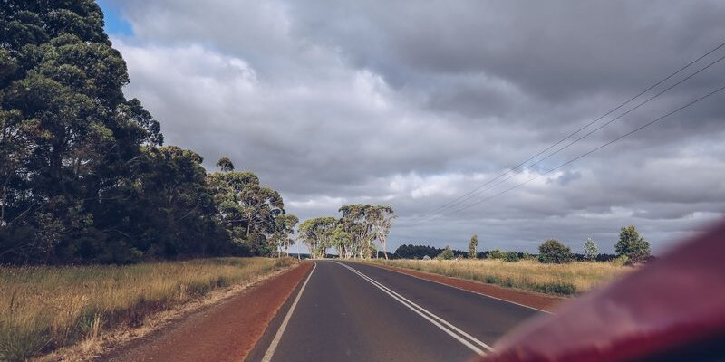

Note that controls for whether to publish or not exist with the 'published' flag above.
Markdown formatting is converted to HTML then applied.

# First Header

Lists work here:
- Item 1
- Item 2

## Second Header

Images look like this:

### Third Header

